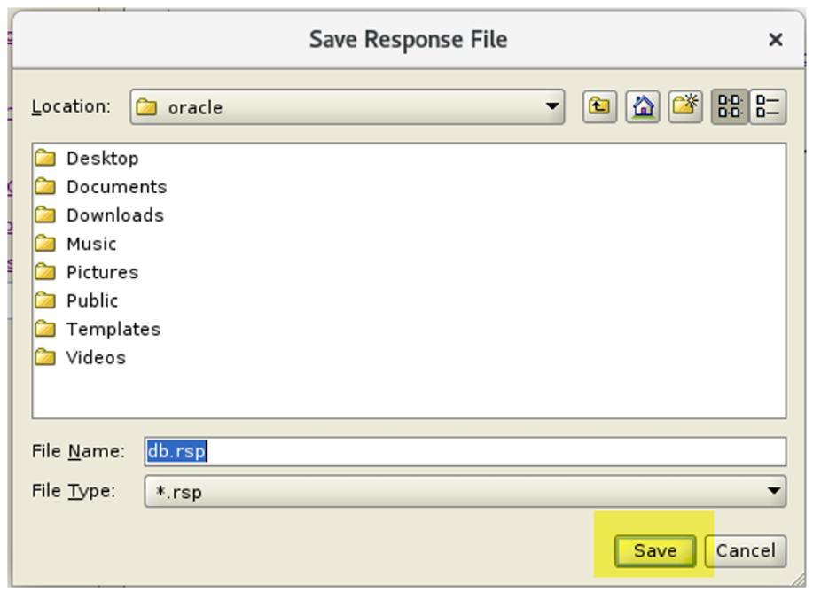

### 1. Tắt Transparent HugePages:
- Kiểm tra: 

```bash
cat /sys/kernel/mm/transparent_hugepage/enabled
```

- Nếu kết quả là [always] → Transparent HugePages (THP) đang được kích hoạt toàn thời gian thì tắt Transparent HugePages. Vào /etc/default/grub và chỉnh parameter GRUB_CMDLINE_LINUX như sau: 

```bash
vi /etc/default/grub

GRUB_CMDLINE_LINUX="crashkernel=auto rhgb quiet transparent_hugepage=never"
```

- Tạo lại (regenerate) file cấu hình GRUB2 (grub.cfg), lưu tại đường dẫn /boot/grub2/grub.cfg và restart máy và kết nối lại:

```bash
grub2-mkconfig -o /boot/grub2/grub.cfg

reboot
```

### 2. Đặt hostname tĩnh và chỉnh "/etc/hostname" 

```bash
sudo hostnamectl set-hostname ol7-19.localdomain

vi /etc/hosts

--- thêm dòng dưới vào 
10.0.2.15  ol7-19.localdomain  ol7-19
```

### 3. Lấy bản sửa lỗi và lỗi bảo mật Linux mới nhất và áp dụng:

```bash
yum update -y
Reboot
```

### 4. Đăng nhập vào server với tư cách là root rồi chạy lệnh sau để tự động cài đặt và cập nhật các gói hệ điều hành cần thiết cho phần mềm Oracle database 19c. 

```bash
yum install oracle-database-preinstall-19c
```

Trong trường hợp thực tế, nếu máy không được kết nối Internet, chúng ta phải tải xuống và cài đặt thủ công các gói cần thiết.


### 5. Xác minh rằng các tham số Kernel được tự động cập nhật bởi lệnh trước đó: 

```bash
cat /etc/sysctl.d/99-oracle-database-preinstall-19c-sysctl.conf
```

### 6. Xác minh rằng các giới hạn tài nguyên được tự động cấu hình cho user oracle: 

```bash
cat /etc/security/limits.d/oracle-database-preinstall-19c.conf 
```

### 7. Xác minh user hệ điều hành đại diện cho chủ sở hữu phần mềm và nhóm OSDBA đã có ở đó. Theo truyền thống, user oracle được sử dụng làm chủ sở hữu phần mềm cho phần mềm cơ sở dữ liệu Oracle. nhóm dba được sử dụng làm nhóm OSDBA. Nếu trong hệ thống, người dùng oracle không có ở đó, chúng ta phải tạo user đó: 

- Kiểm tra user oracle:

```bash
id oracle
```

Cụ thể, nó sẽ hiển thị: UID (User ID): Số ID duy nhất của user. GID (Group ID): Số ID của nhóm chính mà user thuộc về.

- Groups: Danh sách các nhóm mà user đó là thành viên. Nếu chưa có thì tạo user & group và set password cho user:

```bash
groupadd -g 54321 oinstall
groupadd -g 54322 dba
groupadd -g 54323 oper 
groupadd -g 54324 backupdba
groupadd -g 54325 dgdba
groupadd -g 54326 kmdba
groupadd -g 54327 asmdba
groupadd -g 54328 asmoper
groupadd -g 54329 asmadmin
groupadd -g 54330 racdba

useradd -u 54321 -g oinstall -G dba,oper oracle
```
- Tạo lại password cho user oracle:

```bash 
passwd oracle
```

### 8. Set module bảo mật kernel Linux SELinux sang chế độ permissive

```bash 
vi /etc/selinux/config
SELINUX=permissive
setenforce Permissive
```

### 9. Nếu Linux firewall enabled thì disable 

```bash
systemctl stop firewalld
systemctl disable firewalld
```

### 10. Kiểm tra thư mục cài đặt, nếu chưa có tạo các thư mục

```bash
[ -d "/u1/app/oracle/product/19.3.0" ] && echo "exist directory" || echo "not exist directory"
[ -d "/u1/app/oraInventory" ] && echo "exist directory" || echo "not exist directory"
[ -d "/u2/oradata" ] && echo "exist directory" || echo "not exist directory"
[ -d "/u2/fra" ] && echo "exist directory" || echo "not exist directory"

mkdir -p /u1/app/oracle/product/19.3.0/dbhome_1
mkdir -p /u1/app/oraInventory
mkdir -p /u2/oradata
mkdir -p /u2/fra
chown -R oracle:oinstall /u1 /u2 
chmod -R 775 /u1 /u2 
```

### 11. Chuyển user hiện tại sang oracle

```bash
su - oracle
```

### 12. Backup .bash_profile:

```bash
cp /home/oracle/.bash_profile /home/oracle/.bash_profile.old
```

### 13. Tạo 1 thư mục scripts và thực thi các command sau:

```bash
mkdir /home/oracle/scripts

cat > /home/oracle/scripts/setEnv.sh <<EOF
#!/bin/bash
# =====================================================================
# Oracle Environment Setup Script
# =====================================================================

# --- General Settings ---
export EDITOR=vi
export TEMP=/tmp
export TMPDIR=\$TEMP

# --- Oracle Identity ---
# Change these values ​​if needed.
export ORACLE_HOSTNAME=ol7-19.localdomain
export ORACLE_UNQNAME=oradb
export ORACLE_SID=oradb
export PDB_NAME=pdb1

# --- Oracle Base Directories ---
export ORACLE_BASE=/u1/app/oracle
export ORACLE_HOME=\$ORACLE_BASE/product/19.3.0/dbhome_1
export ORA_INVENTORY=/u1/app/oraInventory

# --- Data, Logs, Backup Directories ---
export DATA_DIR=/u2/oradata

# --- Fast Recovery Area (FRA) ---
export FRA_BASE=/u2/fra
export ORACLE_FRA=$FRA_BASE

# --- System Path Configuration ---
export PATH=\$ORACLE_HOME/bin:\$PATH

# --- Library Path ---
export LD_LIBRARY_PATH=\$ORACLE_HOME/lib:/lib:/usr/lib

# --- Java Classpath ---
export CLASSPATH=\$ORACLE_HOME/jlib:\$ORACLE_HOME/rdbms/jlib

# --- Default NLS Date Format ---
export NLS_DATE_FORMAT="DD-MON-YYYY HH24:MI:SS"

# --- Default file creation permission ---
umask 022

# --- Alias for easier navigation ---
alias cdh='cd \$ORACLE_HOME'
alias cdb='cd \$ORACLE_BASE'

# --- Display confirmation message ---
echo "Oracle Environment for SID [\$ORACLE_SID] is set."

EOF
```

### 14. Thêm một tham chiếu đến tệp "setenv.sh" ở cuối tệp "/home/oracle/.bash_profile".

- Tham chiếu:

```bash
echo ". /home/oracle/scripts/setEnv.sh" >> /home/oracle/.bash_profile
```

- Reload ngay trong session hiện tại:

```bash
source ~/.bash_profile

# or 

. ~/.bash_profile
```

### 15. Tạo script "start_all.sh" Khởi động Oracle Database và Listener và "stop_all.sh" Dừng Oracle Database và Listener. có thể được gọi từ startup/shutdown service. Chắc chắn rằng quyền sở hữu và quyền là chính xác.

```bash
cat > /home/oracle/scripts/start_all.sh <<EOF
#!/bin/bash
. /home/oracle/scripts/setEnv.sh

export ORAENV_ASK=NO
. oraenv
export ORAENV_ASK=YES

dbstart \$ORACLE_HOME
EOF


cat > /home/oracle/scripts/stop_all.sh <<EOF
#!/bin/bash
. /home/oracle/scripts/setEnv.sh

export ORAENV_ASK=NO
. oraenv
export ORAENV_ASK=YES

dbshut \$ORACLE_HOME
EOF

chown -R oracle:oinstall /home/oracle/scripts
chmod u+x /home/oracle/scripts/*.sh
```

- Để để startup hay shudown sử dụng script thủ công ta có thể sử dụng lệnh sau:
~/scripts/start_all.sh
~/scripts/stop_all.sh

### 16. Copy file oracle software từ windown vào linux và install
- Trong cmd window:

```bash
scp -P 2222 "E:\oracle\V982063-01.zip" oracle@127.0.0.1:/u1/app/oracle/product/19.3.0/dbhome_1
```

### 17. Kiểm tra xem tồn tại file đã copy hay chưa và di chuyển vào thư mục $ORACLE_HOME Unzip software:

```bash
cd $ORACLE_HOME
ls -l
unzip -oq V982063-01.zip
```

### 18. Fake Oracle Linux 7
```bash
export CV_ASSUME_DISTID=OEL7.9
./runInstaller
```

### 19. Khi Installer windows mở ra, chọn như bên dưới:


Trong  window installer dưới, chọn Save Response File.




Bấm vào Cancel button


- KIêm tra response file vừa tạo:

```bash
cat /home/oracle/db.rsp
```

- Đổi quyền response file đến 600

```bash
chmod 600 /home/oracle/db.rsp
```

### 20. Bắt đầu installer với silent mode 

```bash
$ORACLE_HOME/runInstaller -silent -responseFile /home/oracle/db.rsp 
```


### 21. Xác minh rằng SQL*Plus chạy từ Oracle home.

```bash
which sqlplus
```

- Kiểm tra nội dung của /etc/oraInst.loc

```bash
cat /etc/oraInst.loc
```

- Kiểm tra nội dung của tệp Inventory.

```bash
cat /u1/app/oraInventory/ContentsXML/inventory.xml
```

- Để dọn dẹp, hãy di chuyển hoặc xóa tệp zip cài đặt khỏi thư mục cài đặt.

```bash
-- Remove or use the -f flag(Be very careful with the rm -f command)
rm -f V982063-01.zip

rm -f V982063-01.zip

-- move or move and rename file
mv V982063-01.zip /home/user/install_files/

mv V982063-01.zip /home/user/install_files/Oracle_19c_installer.zip
```

