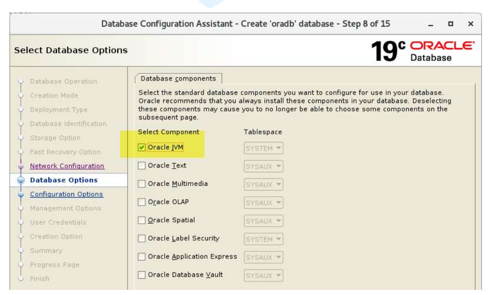
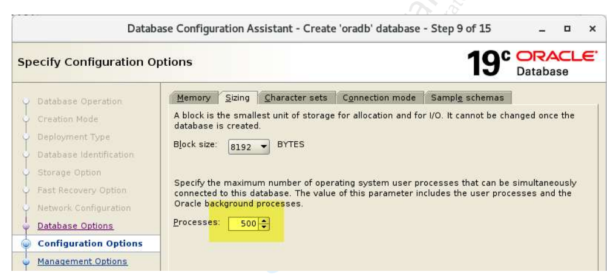
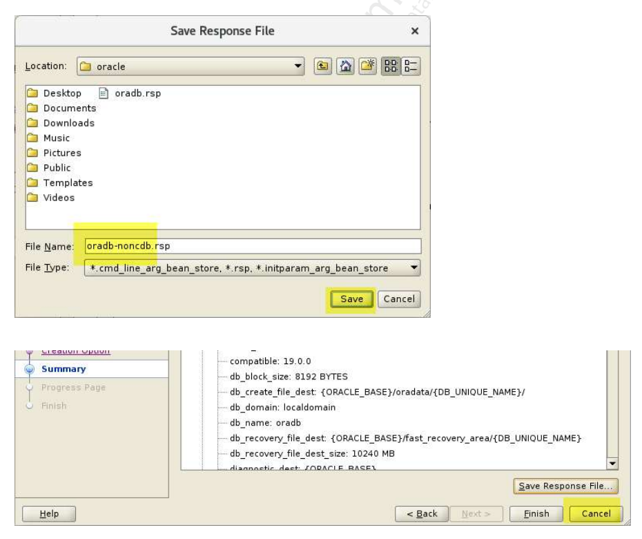

### 1. Đăng nhập với user oracle. Hiển thị các giá trị các biến môi trường cơ bản của Oracle. Đảm bảo các giá trị của các biến đó được đặt đúng trước khi gọi dbca.

```bash
echo $ORACLE_BASE 
echo $ORACLE_HOME 
echo $ORACLE_SID
```

### 2. Xác minh rằng không có listener nào đang chạy trong hệ thống. Việc này, không bắt buộc, nhưng là một bước kiểm tra quan trọng để tránh xung đột hoặc lỗi trong quá trình cài đặt, nhất là khi:

- Tạo CDB/PDB mới

- Có nhiều DB cùng lúc

- Dùng file .rsp có cấu hình mạng

- Dùng cổng 1521 mặc định

```bash
-- Kiểm tra trạng thái listener
lsnrctl status 
-- Kiểm tra process listener
ps -ef | grep lsn 
```

- Nếu đã có listener và muốn xóa đi để tạo lại cho sạch (ví dụ để tránh lỗi, đổi tên listener, hoặc thay đổi port), có thể xóa listener hiện tại một cách an toàn theo các bước dưới đây:

```bash
-- Kiểm tra listener hiện tại 
lsnrctl status

-- Dừng listener lsnrctl stop [alias_listener], mặc định là LISTENER
lsnrctl stop LISTENER

-- di chuyển đến thư mục chứa listener & tnsnames.ora, nếu file tồn tại thì backup
cd $ORACLE_HOME/network/admin
[ -f listener.ora ] && mv listener.ora listener.ora.bak
[ -f tnsnames.ora ] && mv tnsnames.ora tnsnames.ora.bak

-- Kiểm tra tiến trình, nếu còn thì kill
ps -ef | grep tnslsnr
kill -9 <pid>
```

### 3. Tạo 1 listener mới 

```bash
netca -silent -responsefile /u1/app/oracle/product/19.3.0/dbhome_1/assistants/netca/netca.rsp
```

### 4. Xác minh rằng dbca được gọi từ thư mục home của Oracle.

```bash
which dbca
```

### 5. Gọi dbca

```bash
dbca
```

### 6. Tại cửa sổ dbca, làm các bước như sau:

- Database option: Có các option sau

	- Create a database: Tạo mới 1 database
	- Configure an existing database: Nếu bạn đã tạo 1 database trước đó, bạn có thể tùy chỉnh cấu hình ở phần này.
	- Delete database: Xóa 1 database đã có
	- Manage template: Quản lý các database template
	- Manage pluggable databases: Quản lý các pluggable database

	Ở đây ta chọn option Create a database.

	
	
- Creation mode: Có 2 option 

	- Typical configuration: Cấu hình đơn giản cho người mới làm quen với Oracle Database
	- Advanced configuration: Có nhiều tùy chọn cấu hình hơn, để bạn khám phá.
	
	Ở bước này, chọn option Advanced configuration

	
	
- Database deloyment type: 
	
	Có thể lựa chọn loại database là Single Instance, Real Application Cluster (RAC) hay RAC One node.

	Phần Select a template for your database, cho chúng ta lựa chọn template nào là phù hợp cho database của mình.

	Template là 1 bộ các tham số cấu hình (parameter) phù hợp cho các yêu cầu đặc thù của từng database:

	- General Purpose or Transaction Processing: Template dành cho các database giao dịch trực tuyến (hay OLTP)
	- Database Warehouse: Template dành cho các database phân tích (hay OLAP)
	- Custom Database: Cấu hình tùy chọn
	
	

- Database identification: 

	- Trong quá trình chạy, ./runInstaller bằng GUI không tự động lấy tên database (Global Database Name) và SID từ file .bash_profile, 
	thay vào đó, nó sử dụng các giá trị mặc định trong các ô nhập liệu, và giá trị mặc định phổ biến nhất của Oracle chính là orcl.

	- File .bash_profile chỉ có tác dụng cho các lệnh trong terminal sau khi cài đặt hoàn tất. Do đó: tại bước "Database Identification", sẽ thấy các trường:

		- Global Database Name: Tên toàn cục của database. Mặc định nó sẽ điền là orcl.localdomain.

		- Oracle System Identifier (SID): Tên định danh của instance. Mặc định nó sẽ tự điền là orcl.

	- khi cài dbca bằng Gui, măc định database files location: {ORACLE_BASE}/oradata/{DB_UNIQUE_NAME} và Fast Recovery Area: {ORACLE_BASE}/fast_recovery_area/{DB_UNIQUE_NAME}.
	Đây chính là bước cần phải chủ động sửa lại các giá trị mặc định orcl nếu ko muốn sử dụng, ở đây ta sửa lại các giá trị như trong bash_profile đã set.
	
	- Nếu tích vào option: Create as Container database, database được tạo mới sẽ là loại Container Database (12c+).
	Nếu không chọn option này, database được tạo mới sẽ là database kiểu truyền thống giống như ở các phiên bản trước 12c.
	
	- Khi chọn option Create as Container database:
	
		- Use Local Undo tablespace for PDBs là 1 option giúp tăng cường hiệu năng cho Oracle database, có từ bản 12.2+

		- Ở option PDB Name, nếu chọn tạo 1 PDB ở bước trên thì đây cũng chính là tên của PDB. Còn nếu chọn tạo từ 2 PDB trở lên thì, đó là tên tiền tố của PDB.
		
		
	
- Storage option: 

	- các option sau để chỉ định đường dẫn lưu datafile

		- Use template file for database storage attributes: Đường dẫn lưu datafile sẽ tuân theo template. Thường theo cấu trúc $ORACLE_BASE/oradata/<tên database>
		
		- Use following for the database storage attributes: Đường dẫn tùy chọn.
	
	- Use Oracle-Managed Files (OMF) để sau này có thể tạo datafile hay tablespace một cách nhanh chóng và tiện lợi hơn.

	

- Fast recovery option: 
	
	- chỉ ra đường dẫn đến phân vùng Fast Recovery Area của database. Đây là 1 phân vùng để lưu các dữ liệu có thể sử dụng để phục hồi database như: Archive log, các bản backup, flashback log,…

	- option Enable archiving để kích hoạt chế độ Archive log mode lên.

	
	
- Network configution: lựa chọn Listener để đăng ký thông tin cho Database của mình. Nếu khung bên trên không hiển thị ra bất cứ Listener nào đang hoạt động, hãy tạo ra 1 Listener khác ở option Create a new listener.
Và chỉ nên tạo ra 1 Listener nếu:
	- Cài nhiều phiên bản Oracle song song(Mỗi ORACLE_HOME nên có listener riêng)
	- Muốn dùng port khác (vd: 1522 thay vì 1521)(Tạo listener mới để tránh xung đột)
	- Listener cũ bị lỗi hoặc cấu hình sai(Tạo listener mới sẽ reset lại cấu hình)

	
	
- Database opiton: danh sách các thành phần (components) có thể bật/tắt. Mỗi mục tương ứng với một tính năng của Oracle Database. Các mục phổ biến gồm:

	| **Tùy chọn**                          | **Giải thích / Công dụng**                                                                                                                                                                                           |
	| ------------------------------------- | -------------------------------------------------------------------------------------------------------------------------------------------------------------------------------------------------------------------  |
	| **Oracle JVM**                        | Cài đặt **Java Virtual Machine** trong database. Dùng khi bạn cần chạy **Java Stored Procedures**, **Java-based functions**, hoặc một số sản phẩm Oracle phụ thuộc vào JVM (VD: Oracle XML DB). ✅ Nên bật mặc định. |
	| **Oracle Text**                       | Cho phép tìm kiếm văn bản nâng cao trong cột kiểu **CLOB, VARCHAR2**, hỗ trợ **full-text search**, **fuzzy search**, **stemming**. Dùng nhiều trong hệ thống quản lý tài liệu, hoặc cổng thông tin.                  |
	| **Oracle XML DB**                     | Thành phần để lưu trữ và xử lý **XML** trong database. Một số tính năng (như APEX, hoặc Data Pump) **phụ thuộc** vào XML DB nên thường phải bật. ✅ Nên bật mặc định.                                                |
	| **Oracle Spatial and Graph**          | Hỗ trợ dữ liệu **địa lý (spatial)** và **đồ thị (graph networks)**. Nếu bạn không làm GIS, có thể **tắt để tiết kiệm dung lượng** (~600–800MB).                                                                      |
	| **Oracle Label Security**             | Hỗ trợ **phân loại dữ liệu nhạy cảm** theo cấp độ bảo mật (ví dụ: CONFIDENTIAL, SECRET, TOP SECRET). Dùng trong môi trường chính phủ/quân đội.                                                                       |
	| **Oracle Database Vault**             | Tăng cường **kiểm soát truy cập nội bộ**, giúp ngăn DBA xem dữ liệu nhạy cảm. Dùng cho môi trường có yêu cầu bảo mật cao.                                                                                            |
	| **Oracle OLAP**                       | Tính năng **Online Analytical Processing**, phục vụ cho phân tích dữ liệu đa chiều (data warehouse). Nếu bạn chỉ chạy ứng dụng OLTP, có thể tắt.                                                                     |
	| **Oracle Partitioning**               | Cho phép **chia nhỏ bảng / index** thành các partition để quản lý dữ liệu lớn dễ hơn, cải thiện hiệu năng. ✅ Rất hữu ích cho hệ thống lớn.                                                                          |
	| **Oracle Advanced Analytics**         | Bao gồm **Oracle Data Mining** (thuật toán phân tích, dự đoán, clustering, regression...). Thường dùng cho các hệ thống phân tích dữ liệu.                                                                           |
	| **Oracle Advanced Security**          | Cung cấp mã hóa dữ liệu **Transparent Data Encryption (TDE)**, xác thực mạnh, và các tùy chọn bảo mật mạng. Cần bản **Enterprise Edition**.                                                                          |
	| **Oracle Application Express (APEX)** | Web framework để phát triển ứng dụng trên nền web trực tiếp từ Oracle Database. Nếu bạn không cần phát triển ứng dụng web trong DB, có thể tắt.                                                                      |
	| **Oracle Multimedia (deprecated)**    | Dùng để lưu trữ hình ảnh, âm thanh, video trong DB. Tuy nhiên tính năng này **đã bị deprecated** từ 19c, nên có thể bỏ qua.                                                                                          |
	| **Oracle Data Mining (ODM)**          | Cung cấp các thuật toán **machine learning** (classification, clustering...) trong DB. Một phần của Advanced Analytics.                                                                                              |
	| **Oracle Unified Auditing**           | Cho phép audit toàn diện (ghi nhật ký hoạt động người dùng) trong DB. Có thể bật nếu cần kiểm soát bảo mật hoặc tuân thủ.                                                                                            |
	| **Sample Schemas**                    | Cài đặt các schema mẫu như **HR, SH, OE, PM, IX**, giúp bạn học và thử nghiệm. ✅ Nên bật khi bạn học hoặc thử nghiệm Oracle.                                                                                        |

	
	
- Configution option:

	- Tab  Memory: tùy chỉnh dung lượng cấp phát dành cho SGA và PGA

	
	
	- Tab Sizing: cấu hình số lượng process tối đa cho Database của bạn. Lựa chọn 1 con số hợp lý tùy theo năng lực hiện tại của hệ thống, cao quá có thể gây quá tải CPU, thấp quá thì không tận dụng được tối đa sức mạnh của hệ thống.

	
	
	- Tab Character sets: Nếu dữ liệu trong database của bạn có tiếng Việt, hãy chắc chắn đã lựa chọn option Use Unicode (AL32UTF8) ở bước này.
	
	
	
	- Tab Connection mode: 
	
		- Dedicated server mode: Option này sẽ cấp phát tài nguyên riêng cho từng client connection, giúp tốc độ phản hồi nhanh hơn. Thường nó sẽ phù hợp cho các database server cỡ vừa và lớn, cần phản hồi nhanh.
		
		- Shared server mode: Option này sẽ chia sẻ tài nguyên xử lý với các client connection, phù hợp với các database có cấu hình không quá lớn, nhưng phải phục vụ số lượng lớn client.
	
	
	
- Management option:  
	
		- Configure Enterprise Manager (EM) database Express: công cụ quản trị Enterprise Manager (EM) Express. Đây là 1 công cụ chạy trên nền web, khá tiện để thao tác 1 số tác vụ quản trị cơ bản.

		- Nếu có sẵn 1 hệ thống Cloud Control, có thể đăng ký Database vào hệ thống Cloud Control để quản lý. Bằng cách tích vào option Register with Enterprise Manager (EM) cloud control, và nhập các thông tin cần thiết.

	
	
- User credentials: lựa chọn password riêng cho từng user quản trị của database, hoặc có thể đặt 1 password chung

	
	
- Creation option: 
	- Create Database: DBCA sẽ tạo database ngay lập tức với các thông tin đã cấu hình ở các bước trước (tên DB, storage, memory, character set...). Mặc định nên bật. Dùng khi muốn có DB hoạt động ngay sau khi hoàn tất wizard.

	- Save as a Database Template: Lưu lại toàn bộ cấu hình đã chọn thành một template (.dbt) để có thể tạo nhanh các database tương tự sau này mà không cần cấu hình lại từ đầu.
	Dành cho DBA muốn tái sử dụng cấu hình này nhiều lần (ví dụ: môi trường test/dev/prod có cùng cấu hình).
	
	- Generate Database Creation Scripts: Thay vì DBCA tạo DB ngay, tùy chọn này sẽ tạo ra các script SQL và shell/batch (như CreateDB.sql, CreateDB.bat) có thể chạy thủ công sau này.
	Dành cho DBA nâng cao muốn tùy chỉnh script, hoặc cài đặt database trên nhiều máy khác nhau bằng cùng kịch bản.
			
	
	
- Sumary & save response: 
	

	

	

### 7. Kiểm tra tham số dbOptions của response file oradb-noncdb.rsp:

```bash
grep dbOptions /home/oracle/oradb-noncdb.rsp
```
- Response xxx.rsp không trả lại gì ,điều này có nghĩa là nếu chúng ta tạo cơ sở dữ liệu chỉ sử dụng tệp phản hồi, tất cả các tùy chọn cơ sở dữ liệu sẽ được tạo, điều mà chúng ta không muốn.

- Để giải quyết vấn đề này, chúng ta sẽ truyền dbOptions vào dòng lệnh dbca.

- Lưu ý: Tệp phản hồi cũng không chứa mật khẩu mà chúng ta đã nhập trong cửa sổ dbca.Khi chúng ta sử dụng tệp phản hồi này để tạo cơ sở dữ liệu, nó sẽ nhắc nhập password của SYS hay SYSTEM users.

```bash
dbca -createDatabase -silent -responseFile /home/oracle/oradb-noncdb.rsp -dbOptions JSERVER:true,DV:false,APEX:false,OMS:false,SPATIAL:false,IMEDIA:false,ORACLE_TEXT:false,CWMLITE:false -sampleSchema true
```

Ý nghĩa của từng thành phần:


| Tùy chọn            | Mục đích                                                                                        |
|---------------------|-------------------------------------------------------------------------------------------------|
| `JSERVER:true`      | Cài **Java trong database** – để chạy các Java stored procedures hoặc ứng dụng PL/SQL gọi Java. |
| `DV:false`          | Tắt **Oracle Data Vault** – module bảo mật nâng cao (ít dùng).                                  |
| `APEX:false`        | Tắt **Oracle APEX** – công cụ phát triển ứng dụng web trong DB.                                 |
| `OMS:false`         | Tắt Oracle Multimedia – dùng cho ảnh, video, media (đã deprecated).                             |
| `SPATIAL:false`     | Tắt **Oracle Spatial** – xử lý dữ liệu không gian/GIS (bản đồ).                                 |
| `IMEDIA:false`      | Tắt Oracle Intermedia – xử lý hình ảnh, audio, video.                                           |
| `ORACLE_TEXT:false` | Tắt **Oracle Text** – full-text search cho tài liệu, HTML, PDF.                                 |
| `CWMLITE:false`     | Tắt OLAP Catalog Views – dùng cho phân tích dữ liệu nâng cao.                                   |


### 8. Kiểm tra xem tiến trình PMON (Process Monitor) của Oracle Database có đang chạy không.

```bash
ps -ef | grep pmon 
```

Nếu dòng kết quả nếu oracle instance đang chạy có dạng: 

oracle     46316       1  0 00:23 ?        00:00:00 ora_pmon_oradb
oracle     46647   45008  0 00:24 pts/3    00:00:00 grep --color=auto pmon

Trrong đó, ora_pmon_oradb: "oradb" là SID (System Identifier) của Oracle instance.


Vào sqlplus và chạy truy vấn sau đê lấy các tùy chọn đã cài đặt trong cơ sở dữ liệu. Lưu ý rằng JVM đã được cài đặt. APEX chưa được cài đặt. Các thành phần này đi kèm với hầu hết mọi cơ sở dữ liệu.

```bash
sqlplus / as sysdba
set linesize 180
col COMP_NAME for a40
col STATUS for a15
col VERSION for a10
SELECT COMP_NAME, STATUS, VERSION FROM DBA_REGISTRY ORDER BY 1;
```

### 9. Kiểm tra xem HR schema đã dc tao hay chưa:

```bash
SELECT USERNAME FROM DBA_USERS WHERE ACCOUNT_STATUS='OPEN';
```

Nếu không thấy HR, hãy thử tìm các schema mẫu khác:

```bash
SELECT USERNAME FROM DBA_USERS WHERE USERNAME IN ('HR', 'OE', 'SH', 'PM', 'IX', 'BI');
```

### 10. Nếu HR schema chưa dc cài, cài HR schema thủ công bằng các bước sau:

- Xác định thư mục chứa script mẫu:

```bash
cd $ORACLE_HOME/demo/schema/human_resources
ls
```

- Nếu database là PDB (pluggable database)

	- Vào SQL*Plus và chạy script:

	```bash
	@ $ORACLE_HOME/demo/schema/human_resources/hr_main_new.sql 
	```

	- Trả lời các câu hỏi của script, Script sẽ hỏi:

	. Password cho user HR (ví dụ: hr)

	. Tablespace mặc định cho HR (ví dụ: users)

	. Tablespace temporary cho HR (ví dụ: temp)

	. Log path (ví dụ: hr.log)

	. chú ý: Oracle 19c trở đi, password có ký tự @ thường gây lỗi ORA-00922 nếu không đặt trong nháy kép "".

- Nếu database là CDB (Container Database:

	Nếu đang ở trong CDB (Container Database) thì chạy luôn đoạn script trên sẽ bị lỗi như: ORA-65096: invalid common user or role name. Schema HR là local user, nên chỉ được tạo bên trong PDB (ví dụ: pdb1), ta sẽ khắc phục như bên dưới.
	
	– Kiểm tra bạn đang ở container nào:
	```bash
	SHOW CON_NAME;
	```
	Nếu thấy kết quả:
	CON_NAME
	------------------------------
	CDB$ROOT

	=> đang ở CDB, cần chuyển vào PDB trước khi chạy script HR.
	
	– Liệt kê các PDB hiện có:
	
	```bash
	SHOW PDBS;
	```
	kết quả:
	CON_ID CON_NAME   OPEN MODE  RESTRICTED
	------ ---------- ---------- ----------
	2      PDB$SEED   READ ONLY  NO
	3      PDB1       READ WRITE NO

	- Mở PDB nếu chưa mở(MOUNTED):
	```bash
	ALTER PLUGGABLE DATABASE PDB1 OPEN;
	```
	
	- Chuyển vào PDB:
	```bash
	ALTER SESSION SET CONTAINER = PDB1;
	-- kiểm tra
	SHOW CON_NAME;
	```
	
	- Chạy lại script HR như các bước bên trên.

- Sau khi cài xong, xác nhận lại xem HR Schema đã có chưa:

```bash
SELECT COUNT(*) FROM HR.EMPLOYEES;
SELECT USERNAME, ACCOUNT_STATUS FROM DBA_USERS WHERE USERNAME = 'HR';
```

### 11. Thoát khỏi Sqlplus, sau đó kiểm tra xem mục kết nối đến oradb đã được thêm vào tệp tnsnames.ora hay chưa.

```bash
cat $ORACLE_HOME/network/admin/tnsnames.ora
```

### 12. Vào server ,mở firefox vào EM Express với Url sau: https://ol7-19:5500/em với user sys.

### 13. Xóa oracle database:
```bash
dbca -silent -deleteDatabase -sourceDB ${ORACLE_SID} -sysDBAUserName sys -sysDBAPassword your-password
```


