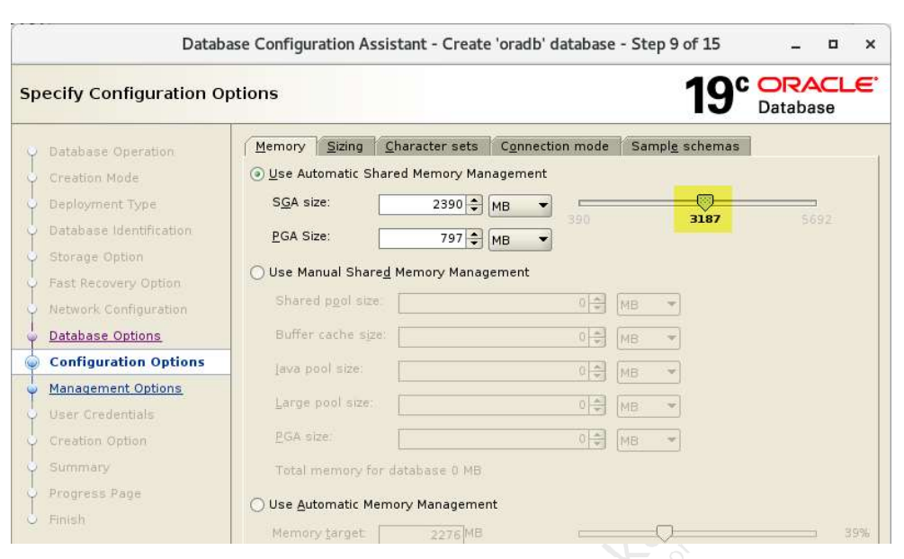
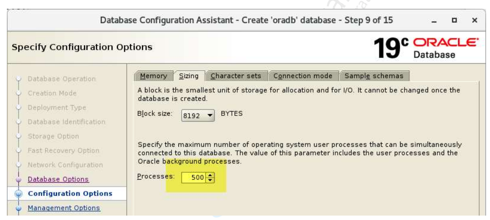
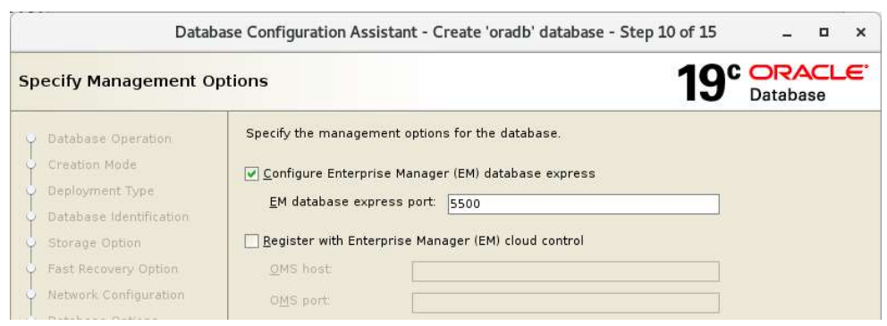
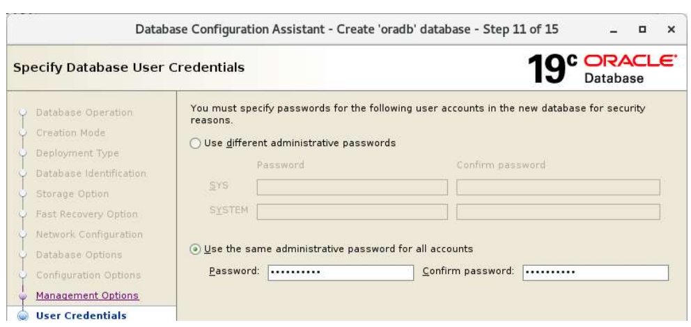
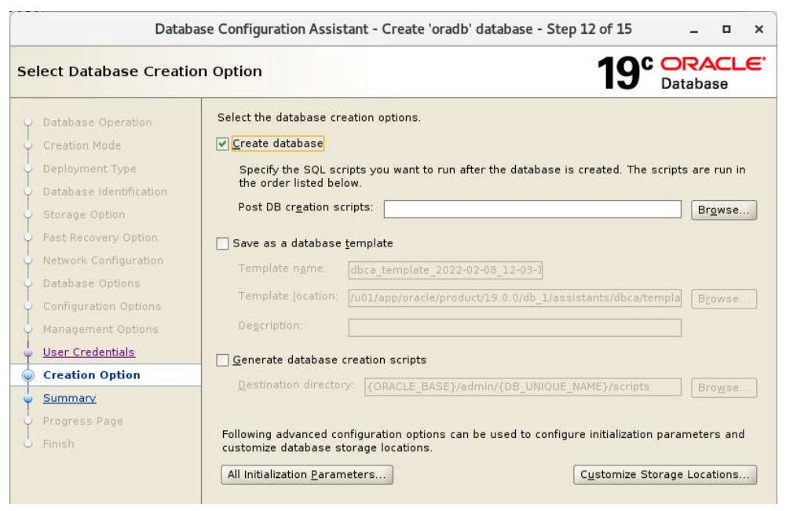
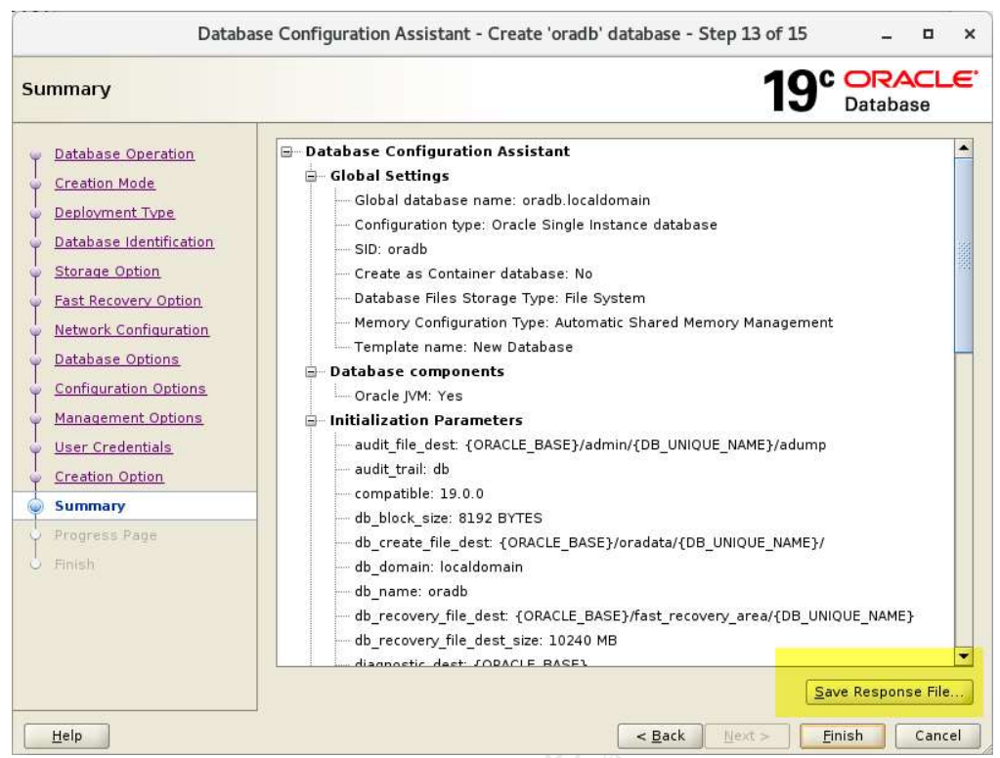
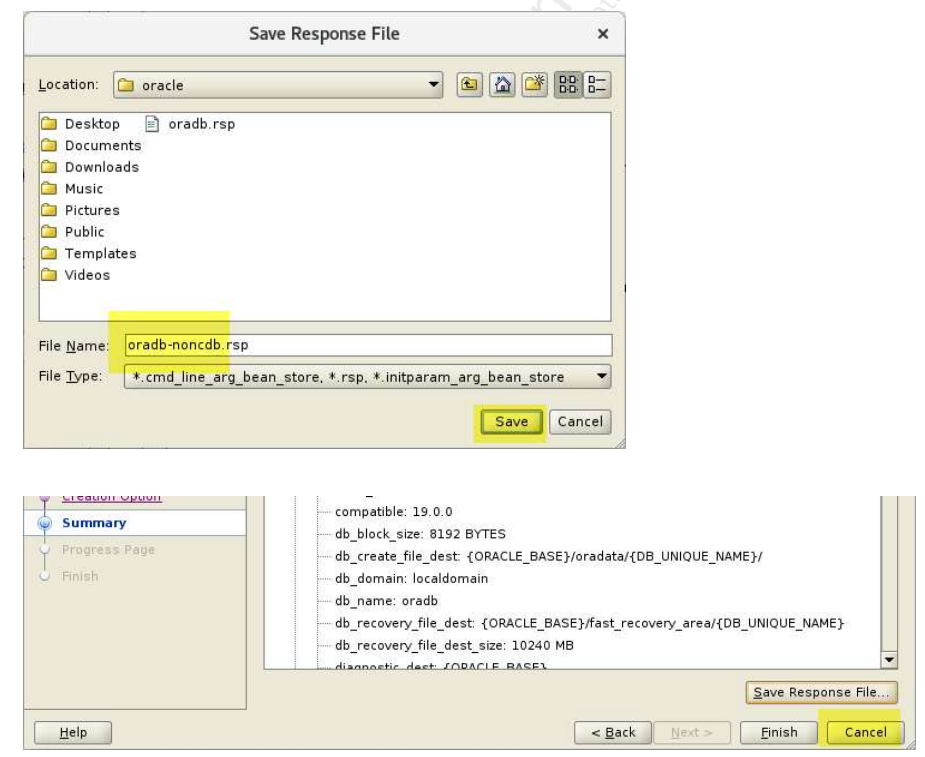

### 1. Đăng nhập với user oracle. Hiển thị các giá trị các biến môi trường cơ bản của Oracle. Đảm bảo các giá trị của các biến đó được đặt đúng trước khi gọi dbca.

```bash
echo $ORACLE_BASE 
echo $ORACLE_HOME 
echo $ORACLE_SID
```

### 2. Xác minh rằng không có listener nào đang chạy trong hệ thống

```bash
lsnrctl status 
ps -ef | grep lsn 
```

### 3. Tạo 1 listener mới 

```bash
netca -silent -responsefile /u01/app/oracle/product/19.3.0/dbhome_1/assistants/netca/netca.rsp
```

### 4. Xác minh rằng dbca được gọi từ thư mục home của Oracle.

```bash
which dbca
```

### 5. Gọi dbca

```bash
dbca
```

### 6. Tại cửa sổ dbca, làm các bước như sau:















### 7. Kiểm tra tham số dbOptions của response file oradb-noncdb.rsp:

```bash
grep dbOptions /home/oracle/oradb-noncdb.rsp
```
Response oradb-noncdb.rsp không trả lại gì ,điều này có nghĩa là nếu chúng ta tạo cơ sở dữ liệu chỉ sử dụng tệp phản hồi, tất cả các tùy chọn cơ sở dữ liệu sẽ được tạo, điều mà chúng ta không muốn.

Để giải quyết vấn đề này, chúng ta sẽ truyền dbOptions vào dòng lệnh dbca.

Lưu ý: Tệp phản hồi cũng không chứa mật khẩu mà chúng ta đã nhập trong cửa sổ dbca.Khi chúng ta sử dụng tệp phản hồi này để tạo cơ sở dữ liệu, nó sẽ nhắc nhập password của SYS hay SYSTEM users.

```bash
dbca -createDatabase -silent -responseFile /home/oracle/oradb-noncdb.rsp -dbOptions JSERVER:true,DV:false,APEX:false,OMS:false,SPATIAL:false,IMEDIA:false,ORACLE_TEXT:false,CWMLITE:false -sampleSchema true
```

Ý nghĩa của từng thành phần:


| Tùy chọn            | Mục đích                                                                                        |
|---------------------|-------------------------------------------------------------------------------------------------|
| `JSERVER:true`      | Cài **Java trong database** – để chạy các Java stored procedures hoặc ứng dụng PL/SQL gọi Java. |
| `DV:false`          | Tắt **Oracle Data Vault** – module bảo mật nâng cao (ít dùng).                                  |
| `APEX:false`        | Tắt **Oracle APEX** – công cụ phát triển ứng dụng web trong DB.                                 |
| `OMS:false`         | Tắt Oracle Multimedia – dùng cho ảnh, video, media (đã deprecated).                             |
| `SPATIAL:false`     | Tắt **Oracle Spatial** – xử lý dữ liệu không gian/GIS (bản đồ).                                 |
| `IMEDIA:false`      | Tắt Oracle Intermedia – xử lý hình ảnh, audio, video.                                           |
| `ORACLE_TEXT:false` | Tắt **Oracle Text** – full-text search cho tài liệu, HTML, PDF.                                 |
| `CWMLITE:false`     | Tắt OLAP Catalog Views – dùng cho phân tích dữ liệu nâng cao.                                   |


### 8. Kiểm tra xem tiến trình PMON (Process Monitor) của Oracle Database có đang chạy không.

```bash
ps -ef | grep pmon 
```bash

Nếu dòng kết quả nếu oracle instance đang chạy có dạng: 

oracle     46316       1  0 00:23 ?        00:00:00 ora_pmon_oradb
oracle     46647   45008  0 00:24 pts/3    00:00:00 grep --color=auto pmon

Trrong đó, ora_pmon_ORCL: "ORCL" là SID (System Identifier) của Oracle instance.


Vào sqlplus và chạy truy vấn sau đê lấy các tùy chọn đã cài đặt trong cơ sở dữ liệu. Lưu ý rằng JVM đã được cài đặt. APEX chưa được cài đặt. Các thành phần này đi kèm với hầu hết mọi cơ sở dữ liệu.

```bash
sqlplus / as sysdba
set linesize 180
col COMP_NAME for a40
col STATUS for a15
col VERSION for a10
SELECT COMP_NAME, STATUS, VERSION FROM DBA_REGISTRY ORDER BY 1;
```

### 9. Kiểm tra xem HR schema đã dc tao hay chưa:

```bash
SELECT USERNAME FROM DBA_USERS WHERE ACCOUNT_STATUS='OPEN';
```

Nếu không thấy HR, hãy thử tìm các schema mẫu khác:

```bash
SELECT USERNAME FROM DBA_USERS WHERE USERNAME IN ('HR', 'OE', 'SH', 'PM', 'IX', 'BI');
```

### 10. Nếu HR schema chưa dc cài, cài HR schema thủ công bằng các bước sau:

Xác định thư mục chứa script mẫu:

```bash
cd $ORACLE_HOME/demo/schema/human_resources
ls
```

Vào SQL*Plus và chạy script:

```bash
@?/demo/schema/human_resources/hr_main.sql
ls

? là shortcut đại diện cho $ORACLE_HOME.

Trả lời các câu hỏi của script, Script sẽ hỏi:

. Tablespace mặc định cho HR (ví dụ: users)

. Password cho user HR (ví dụ: hr)

. Tablespace temporary cho HR (ví dụ: temp)

. Log path (ví dụ: hr.log)

Sau khi cài xong, xác nhận lại xem HR Schema đã có chưa:

```bash
SELECT COUNT(*) FROM HR.EMPLOYEES;
SELECT USERNAME, ACCOUNT_STATUS FROM DBA_USERS WHERE USERNAME = 'HR';
```

Kết quả mong muốn là: 

  COUNT(*)
----------
       xxx

1 row selected.

USERNAME    ACCOUNT_STATUS
----------- ----------------
HR          OPEN

### 11. Thoát khỏi Sqlplus, sau đó kiểm tra xem mục kết nối đến oradb đã được thêm vào tệp tnsnames.ora hay chưa.

```bash
cat $ORACLE_HOME/network/admin/tnsnames.ora
```

### 12. Vào server ,mở firefox vào EM Express với Url sau: https://ol8-19:5500/em với user sys.


